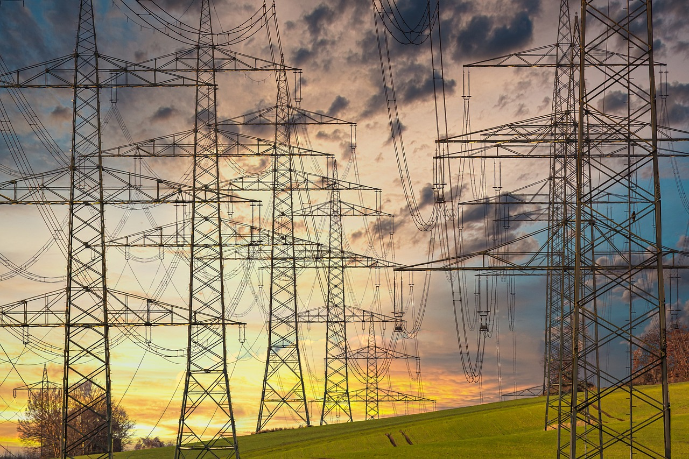

# Energy Access and Electrification Planning in Kenya

### Introduction

The **Rural Electrification Programme** in Kenya aimed to achieve universal electricity access across the country, resulting in **76%** of Kenyan households gaining electricity access. This initiative significantly boosted rural economic resilience in Kenya. However, since its conclusion in 2022, the country has seen a notable decline in electricity access, particularly in generation capacity and reliability.

This project supports the World Bank's Mission 300, which aims to connect 300 million people in Sub-Saharan Africa to electricity by 2030. By leveraging data-driven insights, this project aims to guide energy planning and distribution in Kenya **to scale up connectivity** - a critical factor in addressing the country’s development needs.

### Problem Statement

Kenya’s population has been steadily increasing over the years. Notably, economic planning has not kept pace with this rapid growth.  As a result, an annual estimate of 4.4% rural-urban migration occurs, driven largely by youth seeking employment. However, this migration may not yield stable opportunities, as the Federation of Kenya Employers (FKE) reports a high youth unemployment rate of 67%.

To address the challenges posed by Kenya’s growing population, rising unemployment, and high rates of rural-to-urban migration, the government must implement strategic, long-term economic interventions. 

Prioritizing rural electrification and expanding energy access will stimulate local investments, promote the growth of small and medium-sized enterprises (SMEs), and enhance agricultural productivity through the adoption of advanced technologies. Most critically, fostering job creation within rural areas will drive sustained economic growth, increase household income, and build resilience within rural economies.

### Objective

This project utilizes geospatial data for Kenya to support strategic objectives in wind renewable energy planning.

**Classification and clustering algorithms** were applied to identify areas with sparse grid infrastructure and high population density, to highlight regions where wind farms and wind microgrids could be feasible solutions. 

### Business Understanding
This project addresses the pressing issue of low electricity access rates in Kenya, where approximately 25% of the population lacks reliable electricity.

The project's objective is to use data-driven analysis to identify optimal regions for decentralized electrification solutions, such as wind microgrids.

The topic is critical due to the social and economic impact of energy access on poverty reduction, economic development, and quality of life.

The primary audience includes government entities, NGOs, and private investors interested in sustainable electrification.

By providing a structured approach to identifying high-impact regions for renewable energy projects, the project can support better resource allocation, reduce infrastructure costs, and promote sustainable development.

This project builds upon previous research in energy demand prediction, renewable energy potential assessment, and the socio-economic impact of electrification.

### DATA

### Data Understanding
The following data was used to achieve the project objectives:

Latitudes & Longitudes: These are Kenya’s spatial identifiers sourced from the Global Wind Atlas'.

Population Density: This is the estimated number of people living within a 1 km² area, covering data from the year 2000 to 2020. Source: WorldPop Hub.

Grid Infrastructure: Includes data on grid infrastructure, such as transmission lines and substations, sourced from the World Bank’s Global Electrification Platform (GEP).

Wind Renewable Energy Potential: This identifies regions with high potential for wind renewable energy, based on wind speed measurements at 100 m/s above ground level and sea level. Source: Global Wind Atlas.

Income Distribution: This is the proportion of the Kenyan population living in households with consumption or income per person below the $2.15 poverty line. Source: World Bank’s Global Subnational Poverty Atlas (GSAP).

These datasets collectively enable the assessment and mapping of regions with low electrification rates, high electricity demand, and renewable energy potential.

**1. Data Extraction & Visualization: Kenya's Electricity Generation & Demand**

**2. Data Extraction and Visualization: Renewable Potential**

The map provides a clear visual aid for identifying regions where wind  energy can address gaps in electricity access.

**3. Data Extraction & Visualization: Kenya's Population Density**

**4. Data Extraction & Visualization: Kenya's Income Level**

% of population living in households with consumption or income per person below the $2.15 poverty line.

**5. Data Extraction & Visualization: Grid Infrustructure**

**6. Datasets Merging**

### Machine Learning
**(a). Clustering Algorithms**
*Objective 1:
Identify regions with sparse grid infrastructure and high population density where wind farms and microgrids could be feasible. This will be determined by analyzing population density projections, income distribution, and wind speed.*

### 1.K-Means Clustering

From the above visualization, using 2 clusters is the optimal choice for segmenting regions based on grid infrastructure sparsity and wind microgrid feasibility.

**Explore cluster characteristics**

***Findings;***

**1. Cluster 0**

The areas in cluster 0 are **relatively densely populated** with approximately 95.19 people per square kilometers.

The wind conditions in this cluster are slightly stronger than in Cluster 1, with an average speed of 6.14 m/s at 100 meters above ground level. Therefore, these regions are suitable for both **wind farms and wind microgrids**.

The grid infrastructure in Cluster 0 is significantly limited, with a value of 0.000096. Given the region's population density, there is clearly **high demand for electricity but limited transmission capacity**.

The average income distribution of Cluster 0 is 41.999, indicating that approximately **50% of the population lives below the $2.15 poverty line**. Therefore, this cluster has a higher proportion of people living in poverty.

**2. Cluster 1**

Compared to Cluster 0, the regions in Cluster 1 have a **slightly lower population density** of 94.17 people per square kilometer.

Wind conditions in Cluster 1 are **generally calmer**, with an average wind speed of 5.80 m/s at 100 meters above ground level.

Cluster 1 has a **higher presence of grid structures**, with a grid value of 0.5524, indicating that these regions are likely more developed compared to those in Cluster 0 and have higher access to electricity/energy.

The average income distribution in Cluster 1 is 21.06, indicating that **only 21.06% of the population in these regions lives below the $2.15 poverty line**.

**Evaluation**

-A **Davies-Bouldin Index of 0.73315** indicates that the clusters are relatively compact and distinct.
-A **Calinski-Harabasz Score of 995263.1557610929** data points in each cluster are tightly grouped together, and the clusters themselves are well-separated.

Conclusively, this model has successfully created meaningful clusters with a significant difference between them.

### 2.HDBSCAN

Davies-Bouldin Index: 0.7478548169282285
Calinski-Harabasz Index: 331519.20516841765
Cluster Labels: [ -1  -1  -1 ...  -1 353 353]
Cluster Stability Scores: [0.         0.         0.         ... 0.         0.97330465 0.97330465]

*Fine-Tuning with Grid Search. Explore various combinations of HDBSCAN parameters to optimize clustering performance.*

***Findings***
The visualization reveals distinct groupings of points based on the PCA-reduced data. Clusters appear compact and separated, which aligns with the favorable DBI score. This implies that the areas in the dataset are grouped into well-defined regions based on density.

Some points are scattered and appear isolated from any cluster in the visualization, likely labeled as noise (-1). These noise points are considered outliers by HDBSCAN. In the context of our project (Energy Access and Electrification Planning in Kenya), these points might represent regions with atypical characteristics where extending the grid or establishing microgrids could be inefficient.

Many clusters appear elongated or linear, which could imply correlations between features in the data. This linear structure indicates that certain features (e.g., population density, grid values) might be strongly correlated, influencing cluster shapes.

There are visually distinct groups of clusters, which might represent different types of regions in terms of development or density.This separation could help in identifying areas that are more suitable for microgrids due to their density characteristics.

HDBSCAN has grouped regions with similar density patterns. Clusters representing lower-density, geographically separated areas could be prime candidates for microgrid solutions, where extending a centralized power grid is less efficient. Here the microgrids might be more efficient.

**********************

The clusters identified by HDBSCAN help pinpoint regions where microgrids could be more feasible. Lower-density clusters with less connectivity to high-density regions suggest areas that may benefit from decentralized energy solutions.

The model labels some points as noise, indicating regions that are either too isolated or unique to fit into any cluster. These might require custom solutions, such as isolated power systems or further investigation to understand their unique characteristics.

**(b). Classification Algorithms**
*Objectives 2:
Classify areas based on their suitability for microgrid installation and map regions with high wind speeds to optimize the placement of wind farms and mini-grids in off-grid locations.*

### 3. Random Forest

### 4. XGBoost

### 5.Multi-Layered Perception Model (MLP)

Counties needing electricity:
Income_Distribution_encoded
0      15507
1       8020
2      14165
3      10661
4      13790
5      11684
6       4893
7       8471
8       8485
9      31348
10      9921
11      8346
12      9339
13      6339
14      9494
15      5671
16      8157
17     31939
18      7253
19      8560
20      1632
21     17706
22     23854
23      3505
24     10703
25      4259
26     18119
27      2182
28      8336
29      5639
30      9761
31      5880
32     32058
33      4840
34      5335
35      6454
36      9304
37      4781
38     14067
39      4194
40      5039
41      5632
42    289009
43      7331
44      4906
45      3598
46     11568
dtype: int64

Counties suitable for wind microgrids:
Income_Distribution_encoded
42    406805
dtype: int64

**Visualization of Results by County**

**Findings:**

The machine learning analysis identified regions suitable for microgrids to be relatively densely populated, with an average of approximately 95.19 people per square kilometer. These areas also experience slightly stronger wind conditions, with an average speed of 6.14 m/s at 100 meters above ground level, making them well-suited for wind farms and microgrid installations.

Grid infrastructures in these regions were found to be significantly limited. Given the region's population density, there is clearly a higher demand for electricity but limited transmission capacity.

Approximately 50% of the population lives below the $2.15 poverty line, highlighting the high likelihood of rural-to-urban migration and the urgent need for economic empowerment.

### Recommendations

The **government of Kenya** in collaboration with the **private sector** should adopt this deployment model as a strategic guide for the placement of wind farms and microgrids. This approach will enhance energy and electricity access, promote sustainable development, and strengthen the economic resilience of rural communities.
